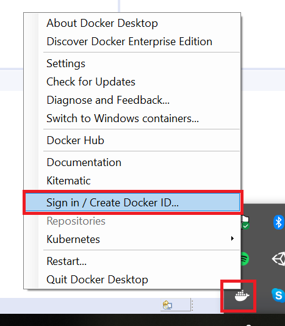
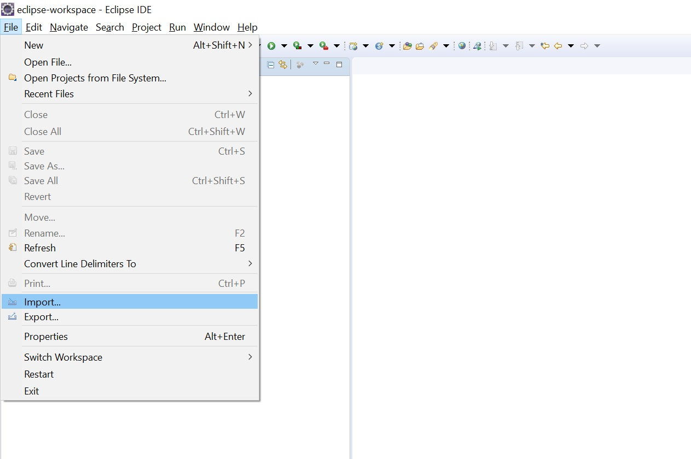
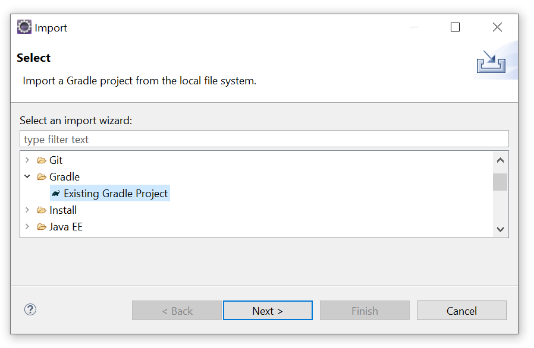
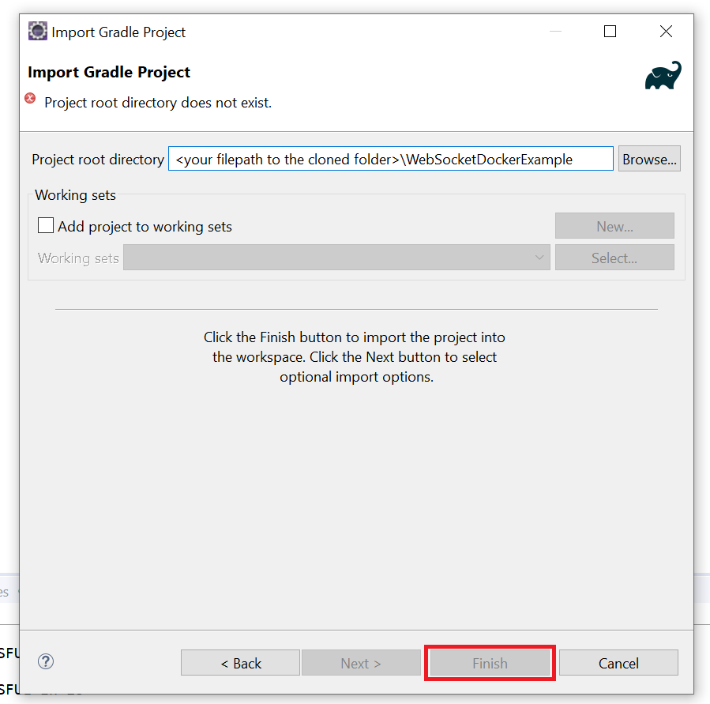
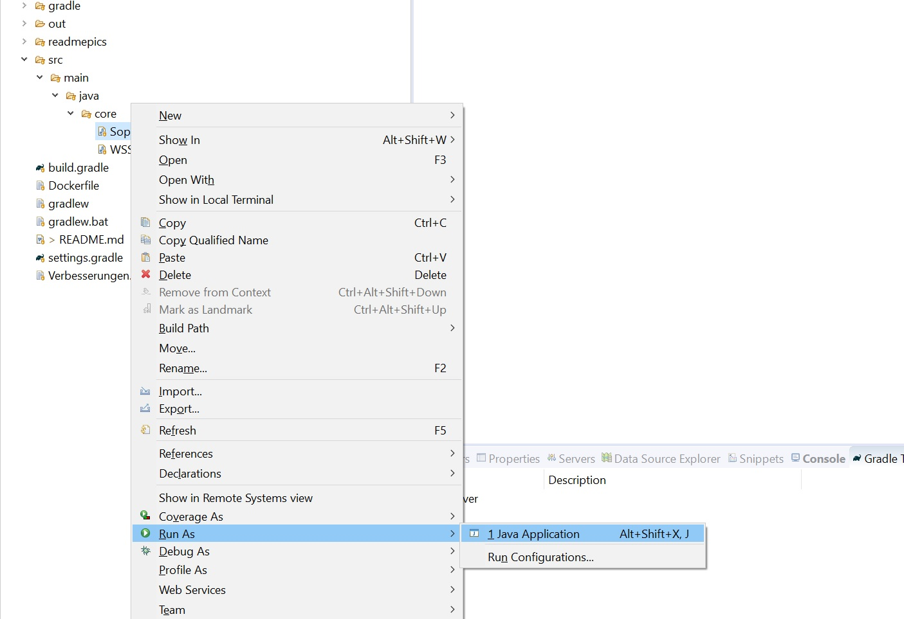
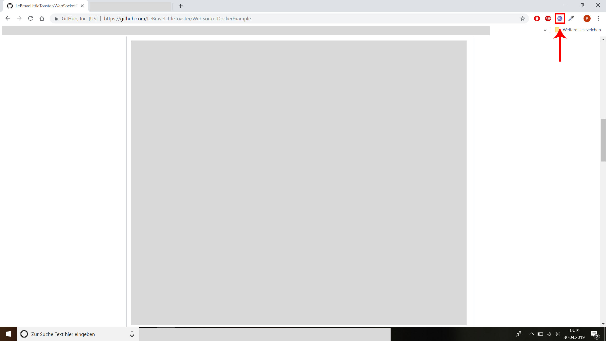
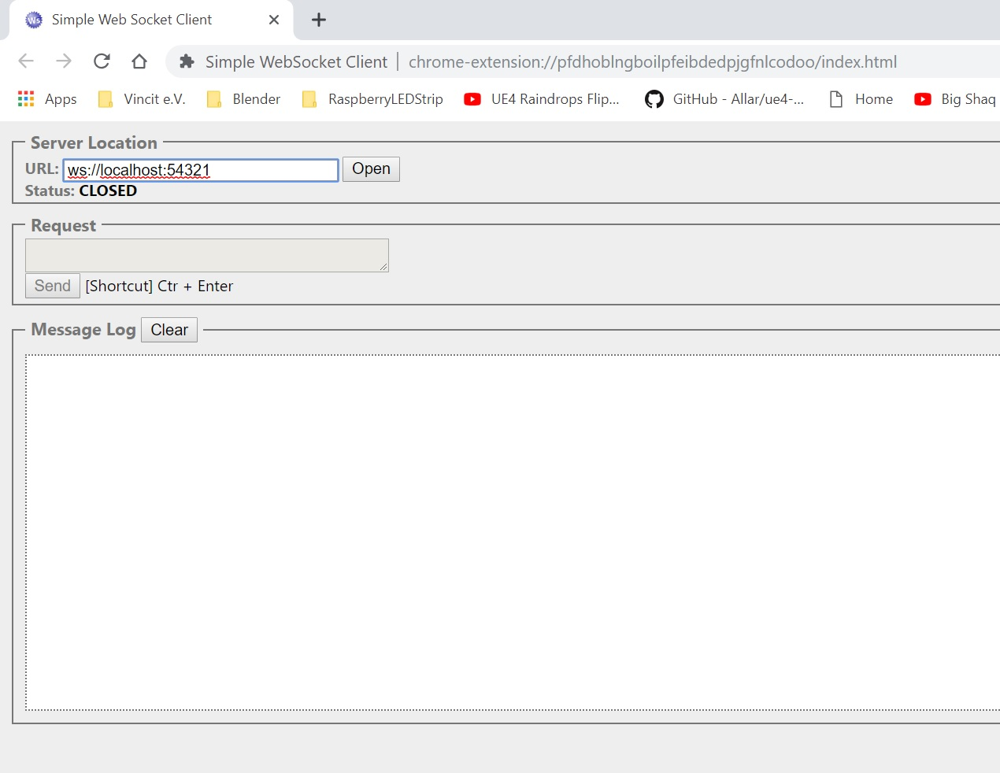
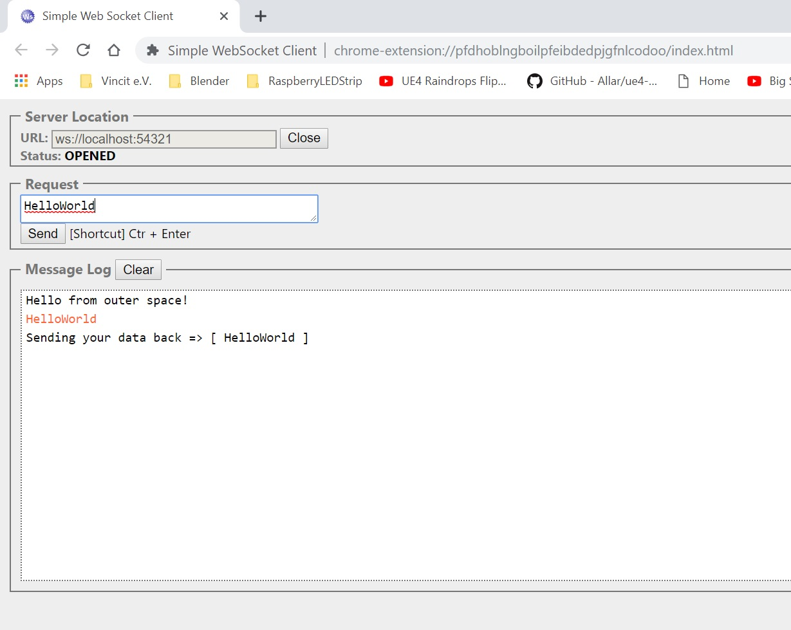

# Whats is this?

The following is a step by step guide to setup Docker with a given java server project to showcase the use of Docker. Please read the instructions carefully. The process should take around 30min up to 1h based on your knowledge.

# What you should already know

- What is the idea behind docker? (it is a container software, easy and consistent environment setup, bla bla bla)
- What Gradle is and how to use it!
- How a command line looks like and what a working directory in a command line is!
- Git clone

# Preparation
- Clone the repo!
- Make yourself a Docker ID at https://www.docker.com/
- At the docker homepage go to Products -> Docker Desktop, download and install it
- Sign in to docker (picture below)


               
- go to your terminal and run 'docker pull java' to get the latest java docker file (we need this later)

# Terminilogy

The following terms are used without explanation

    < insert content >

Everything between the braces should be replaced with the described content.

    < docker ps -> container id >

If you find a -> arrow then you should do the action on the left side and take the information described on the left side.
Example: Run "docker ps" and take the container id

    root folder

The root folder is the first folder in the hierachy. In our case it is the "WebSocketDockerExample" folder.

# Setup the java project


## Import

Import the project as a gradle project in your IDE of choice.





The Java-Example project is a super basic echo websocket server running on port 54321 based on the Websocket-Library from Nathan Rajlich (https://github.com/TooTallNate/Java-WebSocket).

First test the server if it´s working as intended. Just execute the main function in 'core.SopraServer'.



The server is providing a Websocket socket. We need a client to connect to him.


We use the SimpleWebsocketClient (Chrome Extension but also available for Firefox) as a client to test if everything is working as expected ( https://chrome.google.com/webstore/detail/simple-websocket-client/pfdhoblngboilpfeibdedpjgfnlcodoo).

Go to the website and install it (install button) into your browser.


If you stopped the server then execute the Server again in your IDE and connect via this link to your instance:

        ws://localhost:54321




If your Message Log in your client looks like this

    Hello from outer space!

Then your project is setup correctly.
You can echo your inputs by typing a message in the Request window and press "Send".



## Gradle aka the buildprocess [Explanation]

Docker needs a compiled version to execute and cannot deal with bare sourcecode.
For this the project we use the 'application' plugin to generate one without dealing with complex jar creation.


</br>build.gradle

    plugins {
        id 'java'<
        id 'application'
    }

    mainClassName = 'core.SopraServer' <- Points to the class that contains the main-function


</br>To build the needed binaries run the from the application-plugin provided 'installDist' Task in the gradle Tab (under Tasks -> distributions -> installDist). The tasks generates (or populates) a "build" folder in the root of the project. </br>There you can find the 'install" folder which holds your project 'Server' as well as a 'bin' (nice and handy startcripts for linux(sh)/windoof(batch)) and 'lib' (compiled java code) folder.
```
root    
│
└───build
    │   
    └───install
        |
        └───Server
            |
            └───bin
            │   │   Server
            │   │   Server.bat
            │
            └───bin
                |   ...
```

# Docker

## Basics and the Dockerfile

To create a Docker images we need two steps.

- First we build our Docker image based on a Dockerfile
- Second we run it with the needed forwarding etc. (more on that later)

First we take a look at the dockerfile for this project which you can find in the root folder.


    FROM java

    WORKDIR /usr/src/app

    COPY build ./

    EXPOSE 54321

    CMD ["sh", "./install/Server/bin/Server"]


Let´s break that down:

    FROM java

Nearly every dockerimage has a base image which provides us with a basic linux environment and in our case cause we use the official java docker image (which btw. was build on top of a debian linux docker image) we don´t even care about installing java. This step only works cause we pulled the image from docker hub before (see top)</br>

    
    WORKDIR /usr/src/app

The WORKDIR is similar to switches directions on the console, we want to have a dedicated folder for our server and cause we working in a linux environment we place this in the /usr/src/ path.


    COPY build ./

With the COPY command can we copy files into the docker image. Cause we switched our WORKDIR the ./ path is now our WORKDIR path. So we copy our app from our gradleproject <DOCKERFILE_LOCATION>/build/install/ to /usr/src/app in the image.

    EXPOSE 54321

Docker images reject all incoming request by default but our Websocket server is running on port 54321 so we need to expose that port to the outside. We later will map a port from our host system to this port.

    CMD ["sh", "./install/Server/bin/Server"]

The CMD tag highlights the command that should be executed if we run our container later on. This is equal to typing 'sh ./install/Server/bin/Server' to a standard console at our host machine.

## Docker commands

Docker is 99% a command line tool so we need a bunch of commands to get our job done. For this go into a command line of your choice and move to the root of your cloned project (where your dockerfile is)

Be carefull that no instance of the server is running in your IDE! Otherwise the server will crash cause of already used ports!

For this example project we need to following commands in this order:

        docker build -t sopra .
        docker run -p 54321:54321 -d sopra
        docker ps

If everything worked then you now can connect with your client (browser plugin) to the server in the docker image.

- Check if any docker image is running

        docker ps

- Build our image from our Dockerfile and java project ( -t => tag) Dont forger the point at the end

        docker build -t <Any name you want> .

- Run your image ( -p => port forwarding < HostPort > : < image port >)
        
        docker run -p <HostPort>:<imagePort> <The name you choose when building> -d <image name>

- Stop a running image

        docker stop <docker ps -> Container id>

- I did the run command but when typing docker ps no image shows in the table

        docker logs <the looooong id you got when doing the run command>

- I wanna see what my running image do aka logs

        docker logs <docker ps -> Container id>

- Boooring ... wanna see logs in real time!

        docker logs -f <docker ps -> Container id>

- I copied files...maybe...or not...can I connect to the filesystem to check that?

        docker run -t -i <image name> /bin/bash
